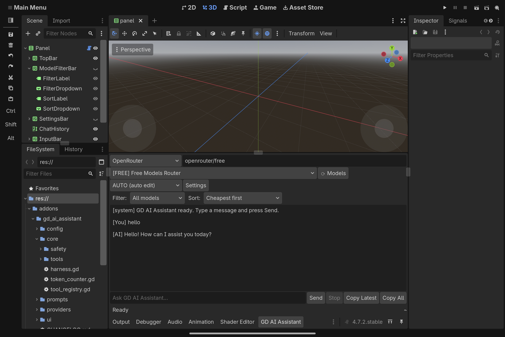
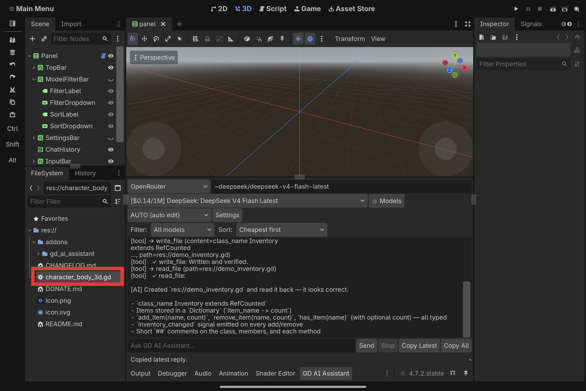

# GD AI Assistant

An AI coding assistant that lives inside the Godot 4 editor. Chat with an LLM, and let it read, edit, and create files in your project — safely.

**Android-first.** Built and tested on an Android tablet. Works on Windows, macOS, and Linux too.

---

## Why another AI plugin?

Most Godot AI plugins assume you're on a desktop. GD AI Assistant is built for people who code on a tablet, with a bottom-panel UI sized for touch, wrapped layout, and careful memory limits.

It also has the widest provider support of any Godot AI plugin: **11 providers** out of the box, plus a Custom endpoint for anything else.

And every file edit is protected by a **seven-layer safety chain** — validate, backup, modify, verify, rollback on failure. Nothing is ever silently corrupted.

---

## Features

- **11 AI providers** — OpenRouter, ModelScope, OpenAI, Anthropic, Google Gemini, Groq, DeepSeek, Mistral, xAI Grok, Ollama (local), LM Studio (local), plus Custom.
- **4 agent modes** — ASK (chat only), PLAN (read-only), AGENT (asks before each edit), AUTO (edits automatically with rollback).
- **Safe file edits** — every write backs up the original, verifies the result, and rolls back if anything is broken.
- **Read-before-edit** — the AI cannot edit a file it hasn't read in the current turn.
- **Model filter + sort** — find free models, sort by cost, or rank by coding-quality heuristics.
- **Local models supported** — run Ollama or LM Studio with zero cloud dependency.
- **Token efficiency** — request budget trimming, per-turn history windowing, size caps on tool results.
- **Android-first UI** — 48px touch targets, wrap-friendly layout, safe on small screens.

---

## Installation

1. Download the latest release from the [Releases page](https://github.com/MASTE2REZVE/gd-ai-assistant/releases).
2. Extract `gd_ai_assistant/` into your Godot project's `addons/` folder.
3. Open Godot: **Project → Project Settings → Plugins**.
4. Enable **GD AI Assistant**.
5. A bottom panel appears. Pick a provider, paste your API key, start chatting.

**Requires Godot 4.4 or newer.** Tested on Godot 4.7.2 stable.

---

## Getting an API key

| Provider | Free tier? | Where to get a key |
|---|---|---|
| OpenRouter | Yes (many free models) | [openrouter.ai/keys](https://openrouter.ai/keys) |
| ModelScope | Yes | [modelscope.ai](https://www.modelscope.ai) → Access Tokens |
| Groq | Yes | [console.groq.com](https://console.groq.com) |
| Google Gemini | Yes | [aistudio.google.com](https://aistudio.google.com) |
| DeepSeek | Paid | [platform.deepseek.com](https://platform.deepseek.com) |
| Mistral | Free tier | [console.mistral.ai](https://console.mistral.ai) |
| xAI Grok | Paid | [console.x.ai](https://console.x.ai) |
| OpenAI | Paid | [platform.openai.com](https://platform.openai.com/api-keys) |
| Anthropic | Paid | [console.anthropic.com](https://console.anthropic.com) |
| Ollama | Free (local) | [ollama.com](https://ollama.com) — no key needed |
| LM Studio | Free (local) | [lmstudio.ai](https://lmstudio.ai) — no key needed |

Keys are stored on your own machine at `user://gd_ai_assistant.cfg`. **They are never committed to your project and never sent anywhere except your chosen provider.**

---

## Agent modes explained

- **ASK** — the AI answers questions but cannot touch your files.
- **PLAN** — the AI can read files and describe a plan, but cannot edit.
- **AGENT** — the AI can edit files, but asks for your approval before each change. **(Default)**
- **AUTO** — the AI edits files automatically. Every change is still backed up and verified.

You can switch modes from the dropdown at the top of the panel at any time.

---

## The safety chain

Every file write goes through seven layers:

1. **Path guard** — `res://` only, no `..`, protected files blocked (`project.godot`, `.godot/`, the plugin's own code).
2. **Read-before-edit** — the AI must have read the file this turn.
3. **Backup** — the original is copied to `user://gd_ai_assistant_backups/`.
4. **Verify** — the written file is parsed and linted.
5. **Rollback** — if verification fails, the backup is restored.
6. **Approval gate** — in AGENT mode, you approve before the write happens.
7. **Checkpoints** — *(coming in v0.2)* every successful write becomes a restorable point.

If something goes wrong, the plugin restores the previous file and tells you exactly what failed.

---

## Screenshots

---

## Roadmap

- **v0.1.0** *(current)* — core plugin, 11 providers, 6 project tools, 4 agent modes, full safety chain.
- **v0.2.0** — scene tools (add nodes, set properties, connect signals), script tools.
- **v0.3.0** — screenshot capture, vision model support.
- **v0.4.0** — pixel art generation via image APIs.
- **v1.0.0** — checkpoints, diff preview, @-mentions, full documentation.

---

## Contributing

Issues and pull requests are welcome. If you find a bug, please include:
- Your Godot version
- Your OS (Android, Windows, macOS, Linux)
- The provider you were using
- The exact error message from the Output panel

---

## Support

GD AI Assistant is free and open source. If it saves you time, you can send crypto — see [DONATE.md](DONATE.md).

Donations don't affect what gets built or in what order. They're just a thank-you.

---

## License

MIT. See [LICENSE](LICENSE).
